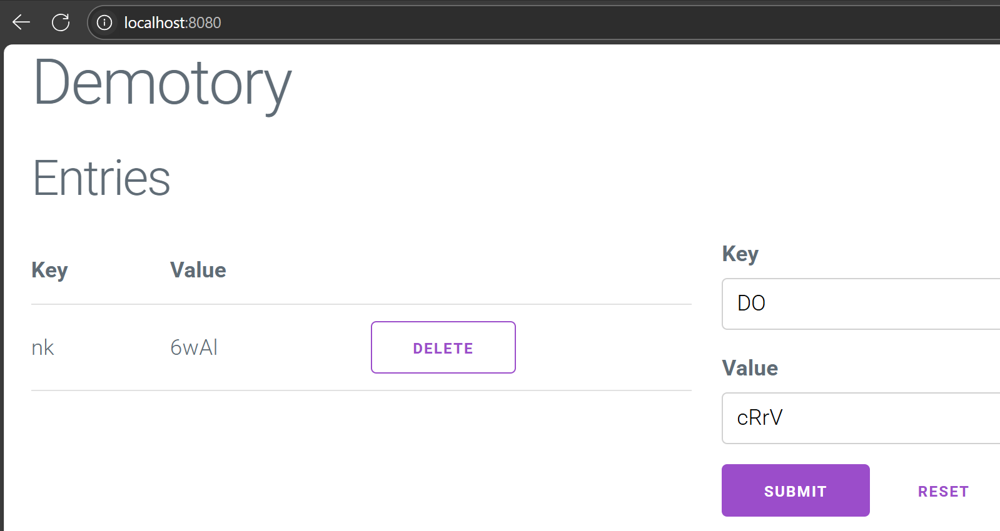
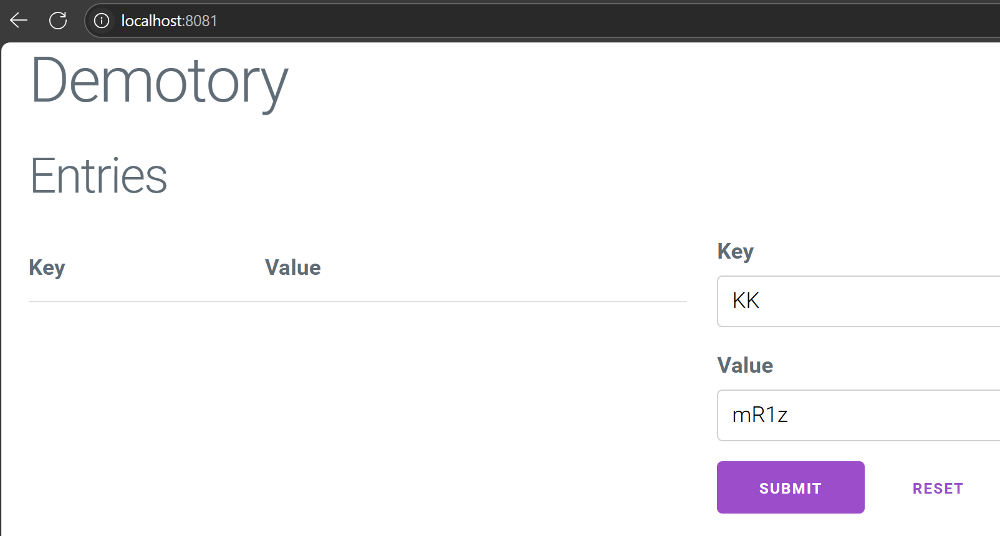
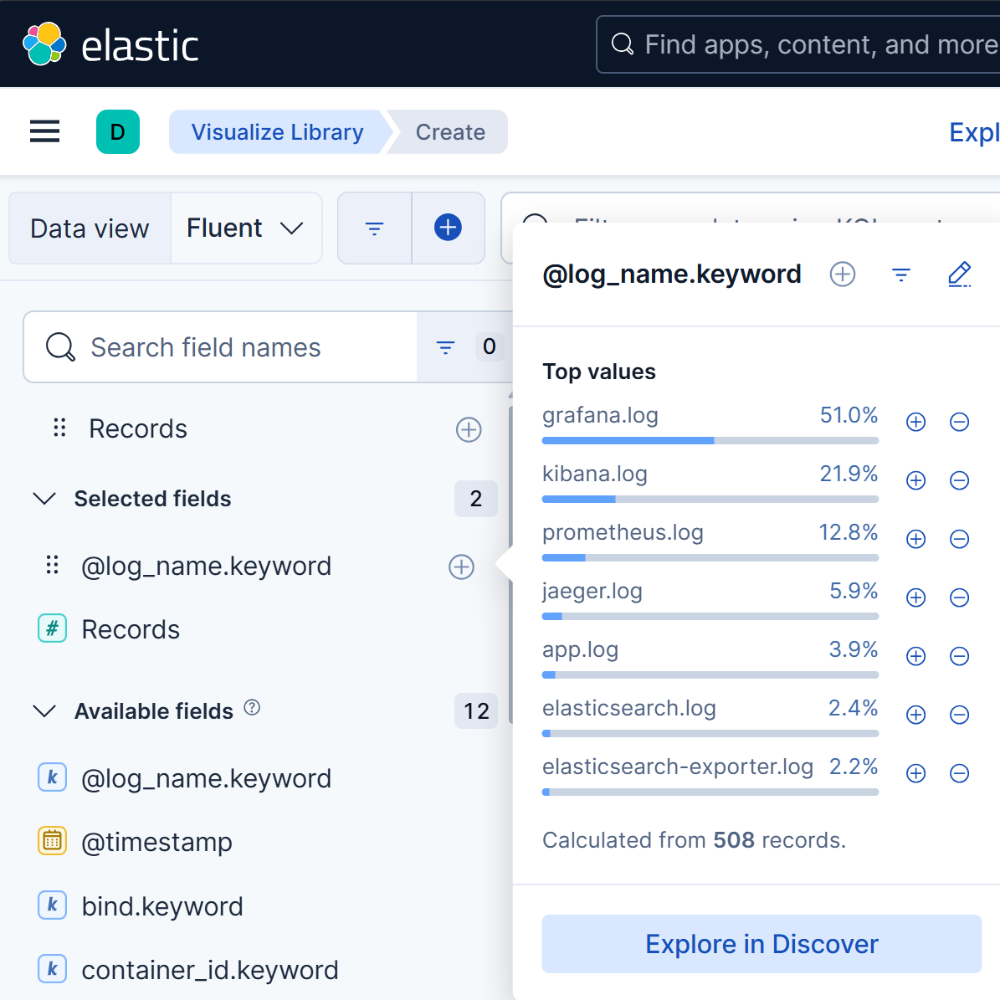
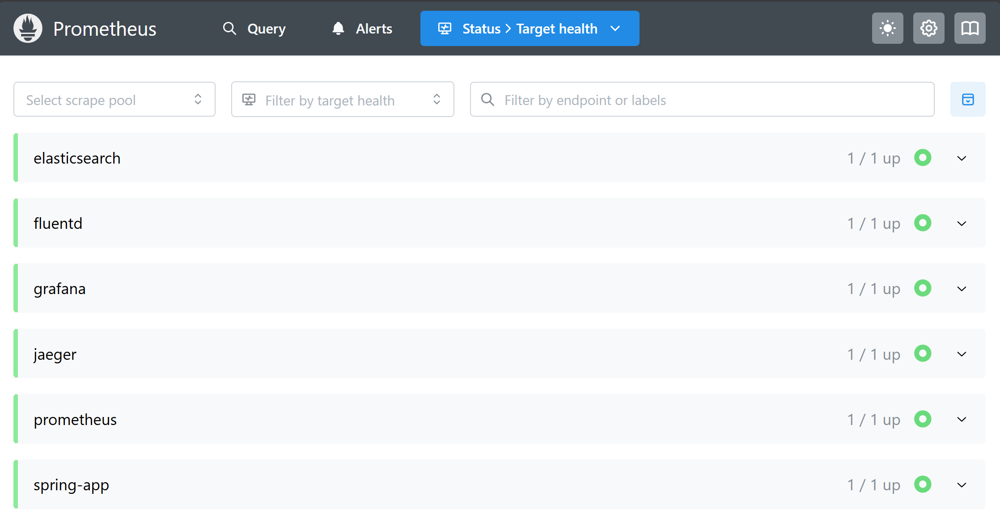
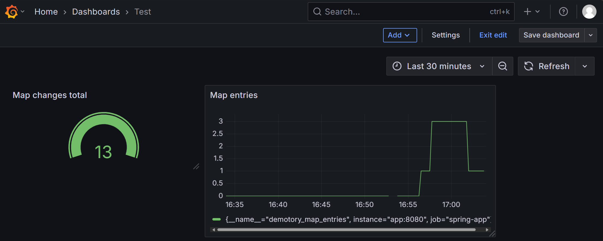

# DOP - Labo 11 - Observabilité
Kevin Auberson

## Estimation
|Tâche|	Temps estimé|	Temps passé|	Commentaire|
|-|-|-|-|
|Estimation|5m|5m||
|Mise en place|2m|2m||
|Docker Compose|15m|45m||
|Instrumentation|1h30|2h30||
|Rapport|30m|1h30||
|Total|2h22|4h52||

## Mise en place
```bash
# http://localhost:8080
mvn spring-boot:run
```


```bash
# http://localhost:8081
mvn spring-boot:run -Dspring-boot.run.arguments=--server.port=8081
```


## Docker
J'utilise un multi-stage build dans le Dockerfile.

1. image Maven(`maven:3.9.9-eclipse-temurin-17-alpine`) pour compiler et packager l'application Java avec toutes ses dépendances.
2. image légère JDK(`eclipse-temurin:17-jdk-alpine`)pour exécuter uniquement le JAR, ce qui réduit la taille de l'image finale.

J'utilise l'optimisation du cache en copiant d’abord le `pom.xml` puis je télécharge les dépendances (`mvn dependency:go-offline -B`) avant de copier le code source. Cela permet de profiter du cache Docker : si le code change mais pas les dépendances, Docker ne retélécharge pas tout.

## Collecteur logs (fluentd)
J’ai choisi Fluentd car déjà utilisé dans un labo précédent ainsi que pour sa compatibilité Docker et son intégration native avec Elasticsearch/Kibana.
### Docker
Docker propose un driver de log natif pour Fluentd, ce qui m'a permis de centraliser les logs de tous les conteneurs sans modifier le code applicatif.

J'utilise l'image `fluent/fluentd:v1.16-debian` et j'y ai ajouté trois plugins :
- `fluent-plugin-elasticsearch` pour envoyer les logs ver Elasticsearch.
- `fluent-plugin-concat` pour regrouper les stacktraces multi-lignes en un seul événement log.
- `fluent-plugin-prometeus` pour exposer les métriques pour le serveur prometheus.

### fluent.conf
Sources :
```conf
<source>
  @type prometheus
  port 24231
</source>

<source>
  @type forward
  port 24224
  bind 0.0.0.0
</source>
```
- **@type prometheus** : expose les métriques internes de Fluentd sur le port 24231 pour être scrappées par Prometheus
- **@type forward** : reçoit les logs envoyés par les container docker.


Filtre :
```conf
<filter /.*\.log$/>
  @type concat
  key message
  multiline_start_regexp /^\d{4}-\d{2}-\d{2}T\d{2}:\d{2}:\d{2}\.\d{3}Z/
  separator ""
  flush_interval 1s
</filter>
```
Regroupe les stacktraces multi-lignes qui commencent par une date ISO afin qu'il apparaisse comme un seul événement dans Elasticsearch/Kibana.

Match :
```conf
<match **>
  @type copy

  <store>
    @type elasticsearch
    host elasticsearch
    port 9200
    logstash_format true
    logstash_prefix fluentd
    logstash_dateformat %Y%m%d
    include_tag_key true
    type_name access_log
    tag_key @log_name
    flush_interval 1s
  </store>

  <store>
    @type stdout
  </store>
</match>
```
- **@type elasticsearch** : envoie les logs vers Elasticsearch pour l'indexation et la recherche.
- **@type stdout** : envoie aussi vers la sortie standard, pour facilité le debug.

## Docker compose

J’utilise les profils dans Docker Compose (apm, only_app) pour pouvoir lancer soit uniquement l’application, soit l’ensemble de la stack d’observabilité.

Tous les services utilisent le driver de log Docker `fluentd` pour envoyer leurs logs à Fluentd, ce qui permet une centralisation et un traitement homogène des logs, quelle que soit la technologie du service.

```yml
logging:
      driver: "fluentd"
      options:
        fluentd-address: localhost:24224
        fluentd-async: "true"
        tag: "service.log"
```

## Elasticsearch et kibana

J'ai choisi la version **9.0.0** d'Elasticsearch et de Kibana car c'est celle que j'ai utilisée lors d'un laboratoire précédent.  
Cela me permet de réutiliser des configurations et des connaissances acquises et de gagner du temps sur la prise en main des outils.


Tous les conteneurs de l’infrastructure envoient leurs logs vers Elasticsearch. Dans Kibana, il est alors possible de filtrer et d’analyser les logs de chaque service individuellement ou globalement.

## Prometheus

J’ai mis en place Prometheus pour collecter les métriques de tous les services de l’infrastructure.
Pour cela, j’ai configuré le fichier `prometheus.yml` avec un job pour chaque service exposant des métriques compatibles Prometheus :

- L’application Spring Boot (`/actuator/prometheus`)
- Prometheus lui-même
- Fluentd (via le plugin Prometheus)
- Elasticsearch (via l’exporter officiel)
- Grafana (endpoint `/metrics` avec authentification)
- Jaeger (endpoint `/metrics`)

### Spring boot
Pour l'application, j'ai ajouter deux dépendances dans le fichier `pom.xml` :
- `micrometer-registry-prometheus` : expose les métriques de l’application au format Prometheus sur l’endpoint `/actuator/prometheus`.
- `spring-boot-starter-actuator` : active les endpoints d’administration et de monitoring.

Puis j'ai ajouter deux configuration dans `application.properties`

```
management.endpoints.web.exposure.include=prometheus
management.endpoint.prometheus.enabled=true
```

### Elasticsearch
Dans Elasticsearch, il n'existe pas d'endpoint Prometheus natif. J’ai donc dû installer et configurer le service `elasticsearch-exporter`. Cet exporter agit comme un pont : il interroge Elasticsearch, extrait des métriques pertinentes et les expose au format Prometheus sur un port dédié.

### Kibana
Kibana n’expose pas nativement d’endpoint compatible Prometheus pour la collecte de métriques.
Il n’est donc pas possible de monitorer directement Kibana avec Prometheus.

### Grafana
Dans le fichier `compose.yml`, j’ai configuré le service Grafana pour qu’il expose ses propres métriques au format Prometheus.

`GF_METRICS_ENABLED=true` : active l’endpoint /metrics sur le port 3000, permettant à Prometheus de collecter les métriques internes de Grafana

### Jaeger
Jaeger expose ses métriques Prometheus par défaut avec l’image `jaegertracing/all-in-one`.



## Grafana

Le fichier `datasource.yml` est monté dans le conteneur Grafana pour que la datasource Prometheus soit automatiquement configurée au démarrage.
Ainsi, toutes les métriques collectées par Prometheus sont directement accessibles dans Grafana.

### Métriques personnalisées
#### Gauge
Pour suivre en temps réel le **nombre d’entrées dans la map Hazelcast** de l’application, j’ai ajouté une métrique de type *gauge* dans le contrôleur Spring Boot.  
J’utilise la classe `Gauge` de Micrometer pour exposer cette valeur :

```java
Gauge.builder("demotory_map_entries", this, ctrl -> ctrl.entriesMap().size())
     .description("Nombre d'entrées dans la map Hazelcast")
     .register(meterRegistry);
```

#### Sums
Pour compter le nombre total de modifications (ajouts ou suppressions) dans la map, j’ai utilisé un counter:

```java
this.mapChangesCounter = meterRegistry.counter("demotory_map_changes_total");

/* A chaque modification de la map, j'incrémente ce compteur*/

mapChangesCounter.increment();
```

La gauge et le compteur sont automatiquement exposés sur l’endpoint `/actuator/prometheus` et peuvent être visualisés dans Grafana.



## Jaeger
J’ai ajouté un service jaeger dans le fichier `compose.yml` utilisant l’image `jaegertracing/all-in-one:1.57`. Déjà utilisé dans un laboratoire précédent. Ce service expose :

- le port 16686 pour accéder à l’interface web de Jaeger (http://localhost:16686)
- le port 14268 pour recevoir les traces envoyées par l’application via HTTP

### Spring boot
Dans le fichier `pom.xml`, j'ai ajouter les dépendances :
- `micrometer-tracing-bridge-brave` : ajoute le support du tracing distribué compatible avec Micrometer.
- `opentelemetry-exporter-jaeger` : permet d’exporter les traces collectées par Micrometer vers Jaeger.

Dans le fichier `application.properties`, j'ai activé le tracing et configuré l'export :
```
management.tracing.enabled=true
management.tracing.sampling.probability=1.0
management.tracing.exporter.jaeger.endpoint=http://jaeger:14268/api/traces
```

Grâce à cette configuration, toutes les requêtes traitées par l’application sont tracées et envoyées à Jaeger.
